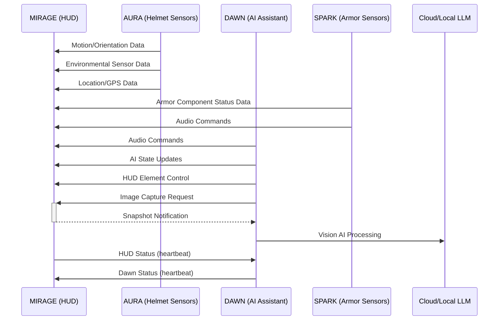

# M.I.R.A.G.E. — Multi-Input Reconnaissance and Guidance Environment

**MIRAGE** is the heads-up display (HUD) component of [The OASIS Project](https://github.com/The-OASIS-Project) — a real-time camera passthrough HUD system designed for wearable displays, specifically an Iron Man-style helmet. It renders live camera feeds with overlaid HUD elements on dual displays (one per eye), with support for object detection, video recording, live streaming, and integration with the other OASIS components via MQTT.

MIRAGE runs on NVIDIA Jetson and Raspberry Pi platforms, using SDL2 for rendering and GStreamer for video encoding. It communicates with [DAWN](https://github.com/The-OASIS-Project/dawn) (AI assistant), AURA (helmet sensors), and SPARK (armor sensors) over MQTT.

> **New to MIRAGE?** See **[GETTING_STARTED.md](GETTING_STARTED.md)** for build instructions and first-run setup.

---

## Features

### Camera Passthrough HUD

- **Dual Stereoscopic Display** — One camera per eye, each rendered to its own display region with configurable stereo offset for depth perception.
- **Single Camera Mode** — One camera split/mirrored for both eyes when dual cameras aren't available.
- **Camera Sources** — CSI (MIPI, via `nvarguscamerasrc` or `libcamerasrc`) and USB (V4L2) cameras.
- **Multiple Resolutions** — 720p/1080p/1440p at 30 or 60fps, selectable at compile time.
- **VSync** — Tear-free rendering via `SDL_RENDERER_PRESENTVSYNC`.

### HUD Elements

All elements are configured via `config.json` — no code changes needed to add, move, resize, or restyle HUD elements.

- **Static Images** — PNG/JPEG overlays positioned anywhere on the display.
- **Animated Sprites** — Spritesheet-based animations with configurable frame rate.
- **Dynamic Text** — Text elements with live data substitution tokens:
  - System: `*FPS*`, `*CPU*`, `*MEM*`, `*SYSTEM_TEMP*`, `*FAN*`
  - GPS: `*LATITUDE*`, `*LONGITUDE*`, `*ALTITUDE*`, `*SPEED*`, `*HEADING*`
  - Battery: `*BATTERY*`, `*BATTERY_VOLTAGE*`, `*BATTERY_CURRENT*`, `*BATTERY_POWER*`
  - Environment: `*HELMTEMP*`, `*HELMHUM*`, `*AIRQUALITY*`, `*TVOC*`, `*ECO2*`
  - Orientation: `*PITCH*`, `*ROLL*`, `*HEADING*`
- **Special Elements** — Data-driven renderers:
  - `map` — Live Google Maps with GPS marker, configurable zoom and map type
  - `detect` — Object detection bounding boxes with confidence scores
  - `gauge` — Dynamic gauges (linear, arc, ring) for sensor data
  - `heading` — Animated compass rose
  - `pitch` — Aircraft-style pitch ladder
  - `altitude` — GPS altitude indicator
  - `wifi` — Signal strength indicator
  - `battery` — Battery status with voltage/current
  - `armor_display` — Multi-component armor status panel
- **Layer System** — Z-ordered rendering, elements can overlap with proper compositing.
- **Per-Element Rotation** — Any element can be rotated.
- **Hotkeys** — Toggle individual elements on/off with keyboard shortcuts.

### Multiple HUD Screens

- **Named HUD Configurations** — Up to 16 HUD screens (e.g., "default", "environmental", "armor", "automotive").
- **Hotkey Switching** — Press 1-9 to switch between HUDs.
- **Animated Transitions** — Fade, slide left, slide right, zoom — with configurable duration.
- **Element Membership** — Each element can belong to one or more HUDs via bitmask.

### Recording and Streaming

- **Video Recording** — GStreamer-based recording with H.264 video + AAC audio. MKV or MP4 container (compile-time selectable).
- **YouTube Live Streaming** — RTMP streaming with hardware encoding.
- **Simultaneous Record + Stream** — Both at once.
- **Hardware Encoding** — Jetson: `nvv4l2h264enc`, RPi: `avenc_h264_omx`.
- **Triple Buffering** — Lock-free frame capture for recording without impacting render performance.
- **Audio Capture** — PulseAudio source (capturing ALSA output device) mixed into recordings.

### Object Detection (Deprecated — Needs Rework)

- **Jetson Inference** — Object detection via NVIDIA's DetectNet (optional, requires `-DUSE_JETSON_INFERENCE=ON`).
- **Per-Eye Detection** — Separate detection threads for left and right cameras.
- **HUD Overlay** — Bounding boxes with labels and confidence scores rendered as HUD elements.

> **Note**: Object detection is currently deprecated and needs work to bring up to current standards. The integration compiles but is not actively maintained.

### OASIS Component Integration (MQTT)

MIRAGE communicates with other OASIS components over MQTT:

- **DAWN (AI Assistant)** — Receives AI state updates, audio commands, snapshot requests for vision AI, HUD element control. Publishes TTS requests and snapshot notifications.
- **AURA (Helmet Sensors)** — Receives motion/orientation (pitch, roll, heading), environmental data (temperature, humidity, air quality, TVOC, eCO2), and GPS coordinates.
- **SPARK (Armor Sensors)** — Receives armor component status (temperature, voltage), connection state, and audio commands.
- **Component Status** — OCP v1.3 keepalive protocol. Publishes `hud/status` with MQTT Last Will and Testament for automatic offline detection. Monitors `dawn/status` for DAWN presence.
- **HUD Discovery** — Publishes available HUD elements and modes to `hud/discovery/*` topics so DAWN can dynamically discover controllable features.

### AI Vision Integration

- **Snapshot Capture** — DAWN requests camera snapshots for AI vision analysis.
- **Async Pixel Reading** — PBO (Pixel Buffer Object) for non-blocking GPU frame capture.
- **Configurable Overlay** — Include or exclude HUD overlay in snapshots.
- **512x512 JPG** — Optimized for LLM vision APIs.

### Configuration

- **JSON-Driven** — All HUD layout, elements, fonts, and display settings in `config.json`.
- **Hot Reload** — Configuration file monitored every 5 seconds; changes applied without restart.
- **Per-Resolution Configs** — Separate config files for different display resolutions (e.g., `config-720p.json`).
- **Runtime Secrets** — API keys and MQTT credentials loaded from `secrets.json` (gitignored, copy from `secrets.json.example`).
- **MQTT Security** — Optional username/password authentication and TLS encryption, configurable without rebuilding.

### Audio

- **Concurrent Playback** — 8 audio threads via POSIX message queues.
- **Ogg Vorbis** — Sound effects and notifications.
- **MQTT-Triggered** — Audio commands from DAWN, AURA, or SPARK.

---

## Platform Support

| Platform | Camera | Encoding | Object Detection | Notes |
|----------|--------|----------|-----------------|-------|
| **Jetson (Orin, Xavier, Nano)** | CSI + USB | Hardware (nvv4l2h264enc) | Yes (Jetson Inference) | Primary target |
| **Raspberry Pi 4/5** | CSI + USB | Hardware (avenc_h264_omx) | No | Lighter workload |
| **Generic Linux ARM** | USB only | Software (x264enc) | No | Fallback |

Platform is auto-detected at build time or selectable via `-DPLATFORM=JETSON|RPI`.

---

## Getting Started

See **[GETTING_STARTED.md](GETTING_STARTED.md)** for full installation, build, and configuration instructions.

### Quick Build (if dependencies are already installed)

```bash
# Using CMake presets (recommended)
cmake --preset debug
make -C build-debug -j$(nproc)

# Or traditional build
mkdir -p build && cd build
cmake ..
make -j$(nproc)
```

### Quick Run

```bash
# Dual CSI cameras, fullscreen
./mirage -f -c csi -n 2

# Single USB camera, black background (UI testing)
./mirage -b -c usb -n 1

# With recording
./mirage -f -c csi -n 2 -r -p ~/recordings/

# With YouTube streaming
./mirage -f -c csi -n 2 -s
```

---

## Command-Line Options

| Flag | Long Form | Description |
|------|-----------|-------------|
| `-b` | `--black-background` | Disable cameras, black background (UI testing) |
| `-c TYPE` | `--camera TYPE` | Camera type: `csi` or `usb` |
| `-d DEVICE` | `--device DEVICE` | USB/serial device path (e.g., `/dev/ttyACM0`) |
| `-f` | `--fullscreen` | Run in fullscreen mode |
| `-h` | `--help` | Display help |
| `-H[=PORT]` | `--helmet-tcp[=PORT]` | Enable helmet TCP server (default port: 3000) |
| `-l FILE` | `--logfile FILE` | Log output to file |
| `-n [1/2]` | `--camcount [1/2]` | Number of cameras (1 = single, 2 = stereo) |
| `-p PATH` | `--record_path PATH` | Directory for recordings |
| `-r` | `--record` | Start recording on launch |
| `-s` | `--stream` | Start streaming on launch |
| `-t` | `--record_stream` | Start recording and streaming |
| `-u` | `--usb` | Enable USB/serial helmet communication |

---

## OASIS Communication



---

## Documentation

| Document | Description |
|----------|-------------|
| **[GETTING_STARTED.md](GETTING_STARTED.md)** | Build instructions, first-run setup, MQTT and secrets configuration |
| **[CODING_STYLE_GUIDE.md](CODING_STYLE_GUIDE.md)** | Code formatting and development standards |
| **[secrets.json.example](secrets.json.example)** | Template for API keys and MQTT credentials |

---

## Related

- **[bigscreen-beyond-linux](https://github.com/KerseyFabrications/bigscreen-beyond-linux)** — tools and findings for driving MIRAGE's DisplayPort output into a **Bigscreen Beyond** DSC VR headset: zero-dependency USB-HID control (LED/fan/brightness), EDID capture, and the NVIDIA Jetson/Tegra DSC bring-up. Research, not a shipped MIRAGE feature — on Jetson the closed Tegra driver currently mis-transmits DSC to the panel, so the headset doesn't display correctly (that repo has the full characterization).

---

## Contributing

Contributions are welcome! MIRAGE is part of The OASIS Project and is licensed under GPLv3.

## License

This project is licensed under the GNU General Public License v3.0 — see the [LICENSE](LICENSE) file for details.
